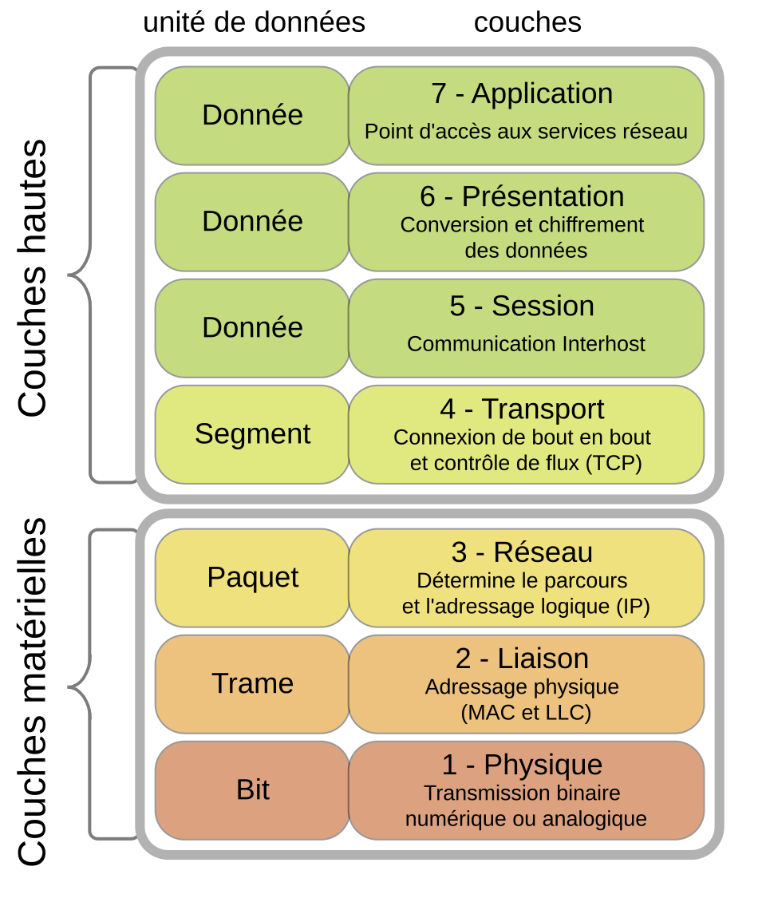
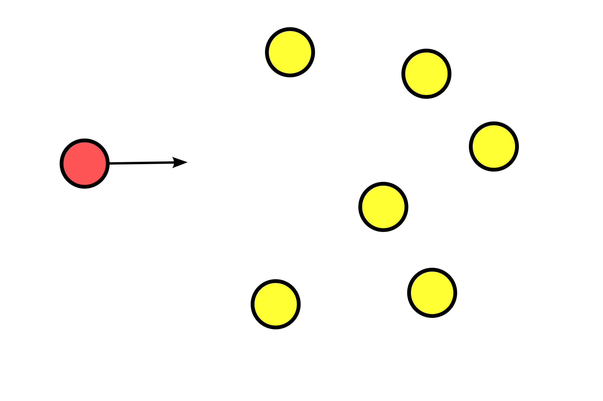
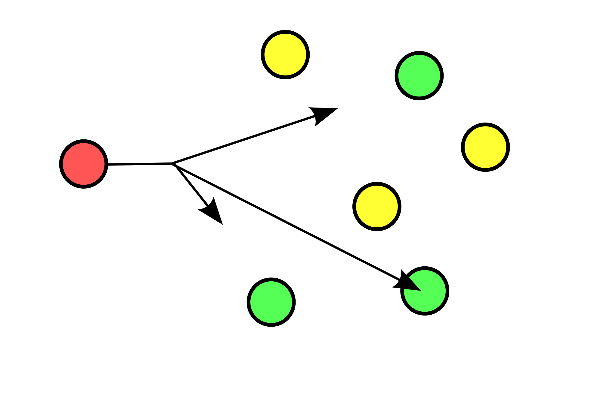
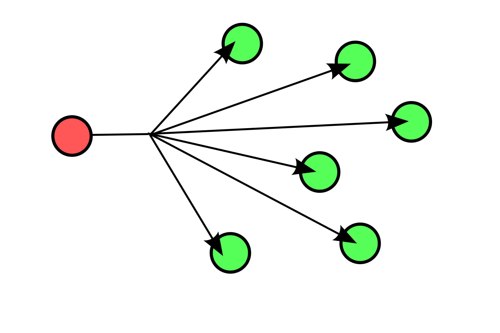
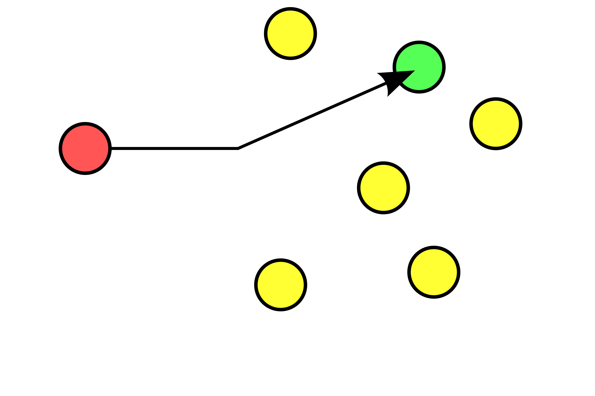
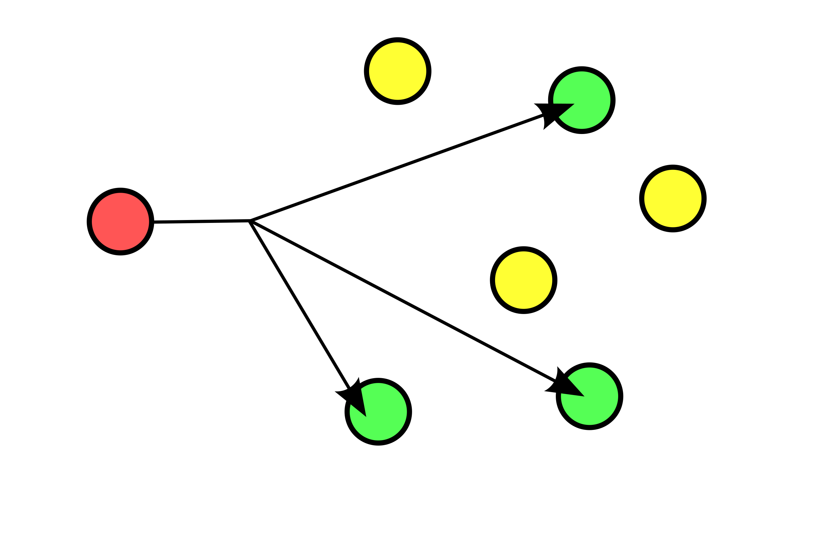
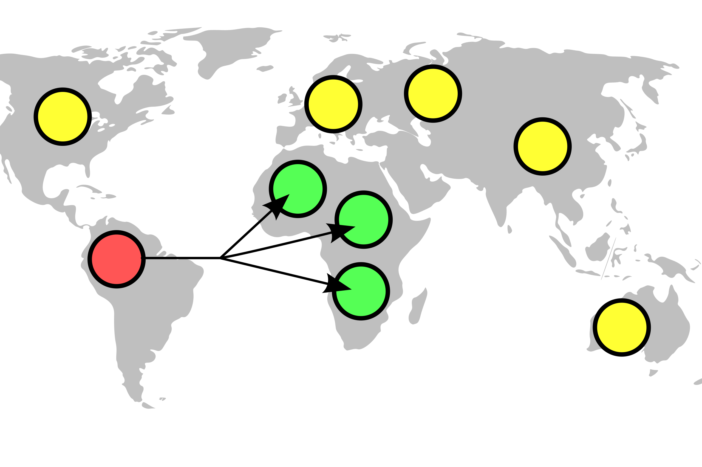

# VXLAN & static et dynamic multicast


> **_WARNING_**: _Avant de poursuivre la suite nous devons voir quelque notion importante avant la suite du projet_

### VXLAN qu'est ce que sait ?
Le **VXLAN** (Virtual Extensible LAN) est une technologie de virtualisation réseau qui vise à résoudre des problèmes d'évolutivité associés au déploiement du cloud computing. Il utilise une technique d'encapsulation proche du **VLAN** et permet d’encapsuler des trames Ethernet de couche 2 OSI dans des datagrammes **UDP** de couche 4. Le numéro de **port UDP** de destination par défaut attribué par l’IANA **pour le VXLAN est le 4789**.
Les paramètres VXLAN, qui cloisonnent les VXLAN et peuvent être des switchs virtuels ou physiques, sont aussi connus sous le terme VTEP (VXLAN Tunnel Endpoints)

### Bridge qu'est ce que sait ?
Un **Bridge** (pont) est un équipement informatique d'infrastructure de réseaux de type passerelle[1]. Dans les réseaux Ethernet, il intervient en couche 2 du modèle OSI (liaison). Son objectif est d'interconnecter deux segments de réseaux distincts, soit de technologies différentes, soit de même technologie, mais physiquement séparés à la conception pour diverses raisons (géographique, extension de site etc.).
Son usage le rapproche fortement de celui d'un commutateur (switch), à l'unique différence que le commutateur ne convertit pas les formats de transmissions de données. Le pont ne doit pas être confondu avec le routeur.

### Les couches OSI qu'est ce que sait ?

Le modèle OSI (Open Systems Interconnection) est une norme de communication de tous les systèmes informatiques en réseau. C'est un modèle de communications entre ordinateurs proposé par l'ISO (Organisation internationale de normalisation) qui décrit les fonctionnalités nécessaires à la communication et l'organisation de ces fonctions.


### Static et dynamic multicast qu'est ce que sait ?

Le **MULTICAST** est une forme de diffusion d'un émetteur (source unique) vers un groupe de récepteurs. Les termes « diffusion multipoint » ou « diffusion de groupe » sont également employés.


**L'UNICAST** définit une connexion réseau point à point, c'est-à-dire d'un hôte vers un (seul) autre hôte. Elle peut également être traduite en envoi individuel ou parfois diffusion individuelle. 

**TYPE DE ROUTAGE:**

<div style="display: flex; align-items: flex-start; gap: 20px;">
  <div style="text-align: center;">
    <div><b>Cast</b></div>
    
  </div>
  <div style="text-align: center;">
    <div><b>Anycast</b></div>
    
  </div>
  <div style="text-align: center;">
    <div><b>Broadcast</b></div>
    
  </div>
  <div style="text-align: center;">
    <div><b>Unicast</b></div>
    
  </div>
    <div style="text-align: center;">
    <div><b>Multicast</b></div>
    
  </div>
    <div style="text-align: center;">
    <div><b>Geocast</b></div>
    
  </div>
</div>

### Topologie de notre reseau VXLAN


## Interface VXLAN Unicast: 


#### router 1 (VTEP 1)
```bash
# Création du bridge local qui va relier les interfaces locales (L2)
ip link add br0 type bridge
# Activation du bridge
ip link set br0 up

# Attribue l'adresse IP publique/transport pour le VTEP local
ip addr add 10.1.1.1/24 dev eth0
# Active l'interface physique utilisée pour le transport
ip link set eth0 up

# Création de l'interface VXLAN (VTEP) en mode unicast vers le pair
# id 10 : identifiant du VXLAN, local : IP locale du VTEP, remote : IP distante du pair
ip link add vxlan10 type vxlan id 10 dev eth0 local 10.1.1.1 remote 10.1.1.2 dstport 4789
# Activation de l'interface VXLAN
ip link set vxlan10 up

# Active l'interface interne vers le LAN raccordé au routeur
ip link set eth1 up
# Connecte l'interface LAN au bridge pour que le trafic L2 traverse le VXLAN
ip link set eth1 master br0
# Connecte l'interface VXLAN au bridge pour intégrer le tunnel au domaine L2
ip link set vxlan10 master br0

# Assigne une adresse IP au bridge pour la gestion/communication dans le sous-réseau virtuel
ip addr add 10.1.1.3/24 dev br0

# optionnel with busybox !
# Table FDB : force le forwarding des trames vers l'IP du peer (unicast)
bridge fdb append 00:00:00:00:00:00 dev vxlan10 dst 10.1.1.2
```

### router 2 (VTEP 2)
```bash
ip link add br0 type bridge
ip link set br0 up
ip addr add 10.1.1.2/24 dev eth0
ip link set eth0 up
ip link add vxlan10 type vxlan id 10 dev eth0 local 10.1.1.2 remote 10.1.1.1 dstport 4789
ip link set vxlan10 up
ip link set eth1 up
ip link set eth1 master br0
ip link set vxlan10 master br0
ip addr add 10.1.1.4/24 dev br0

#Optionel with busybox
bridge fdb append 00:00:00:00:00:00 dev vxlan10 dst 10.1.1.1
```

#### host1
```bash
ip addr add 30.1.1.1/24 dev eth1
```

#### host2
```bash
ip addr add 30.1.1.2/24 dev eth1
```


### Interface VXLAN Dynamique Multicast:

> _**INFO :**_ Le parametres des hosts reste la meme que l'unicast.

#### router 1 (VTEP 1)
```bash
ip link add br0 type bridge
ip link set br0 up

ip addr add 10.1.1.1/24 dev eth0
ip link set eth0 up

ip link add name vxlan10 type vxlan id 10 dev eth0 group 239.1.1.10 dstport 4789
ip link set vxlan10 up

ip link set eth1 up
ip link set eth1 master br0
ip link set vxlan10 master br0
ip addr add 10.1.1.3/24 dev br0
```

#### router 2 (VTEP 2)
```bash
ip link add br0 type bridge
ip link set br0 up
ip addr add 10.1.1.2/24 dev eth0
ip link set eth0 up

ip link add vxlan10 type vxlan id 10 dev eth0 local 10.1.1.2 remote 10.1.1.1 dstport 4789
ip link set vxlan10 up

ip link set eth1 up
ip link set eth1 master br0
ip link set vxlan10 master br0
ip addr add 30.1.1.4/24 dev br0
```


## CLI TESTING

Utilisez ces commandes pour vérifier l'état des interfaces, adresses et du tunnel VXLAN.

```bash
# Affiche toutes les interfaces et leur état
ip link show

# Affiche toutes les adresses IP configurées
ip addr show

# Détails étendus pour l'interface VXLAN (encapsulation, options)
ip -d link show vxlan10

# Affiche les ports et membres du bridge
bridge link
bridge fdb show

# Routes IP
ip route show

# Vérifier la connectivité L3 entre hôtes (exécuter depuis host1)
ping -c 3 30.1.1.2

# Sur le routeur/point de transport : observer les paquets VXLAN UDP
tcpdump -n -i eth0 udp port 4789
```

## CLI DEBUGGING

Commandes utiles pour diagnostiquer les problèmes réseau et kernel.

```bash
# Voir les derniers messages du noyau liés au réseau
dmesg | tail -n 50

# Vérifier si le forwarding IP est activé
sysctl net.ipv4.ip_forward

# Rechercher paramètres réseau globaux
sysctl -a | grep net.ipv4

# Vérifier l'état matériel/driver d'une interface
ethtool eth0

# Voir les voisins ARP/NDP
ip neigh show

# Vérifier les logs du démon réseau ou systemd si nécessaire
journalctl -u NetworkManager -n 100 --no-pager
```

## CLI CLEAR

Commandes pour nettoyer la configuration VXLAN/bridge (exécuter en root).

```bash
# Supprime l'interface VXLAN si présente
ip link del vxlan10 2>/dev/null || true

# Désactive et supprime le bridge
ip link set br0 down 2>/dev/null || true
ip link del br0 2>/dev/null || true

# Supprime les adresses IP des interfaces physiques
ip addr flush dev eth0
ip addr flush dev eth1

# Vider la table FDB du bridge (si nécessaire)
bridge fdb flush dev vxlan10 2>/dev/null || true

# Arrêter tcpdump (exemple) si lancé en arrière-plan
pkill -f 'tcpdump -n -i eth0 udp port 4789' || true
```

> _**Note :**_ shell ash par default utilise busybox, pour simplifier la configuration lancer le shell bash pour l'utilisation de iproute2 avec le cli ``ip``
