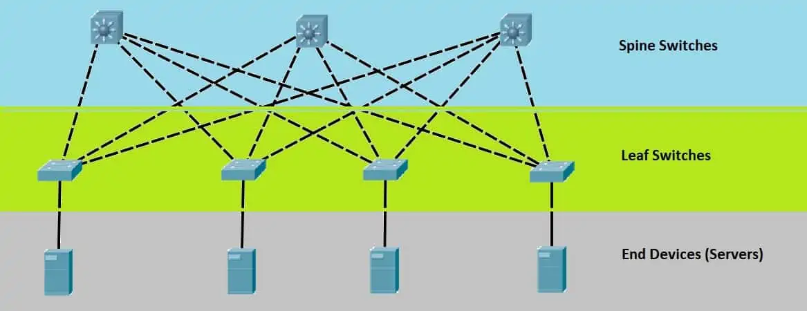
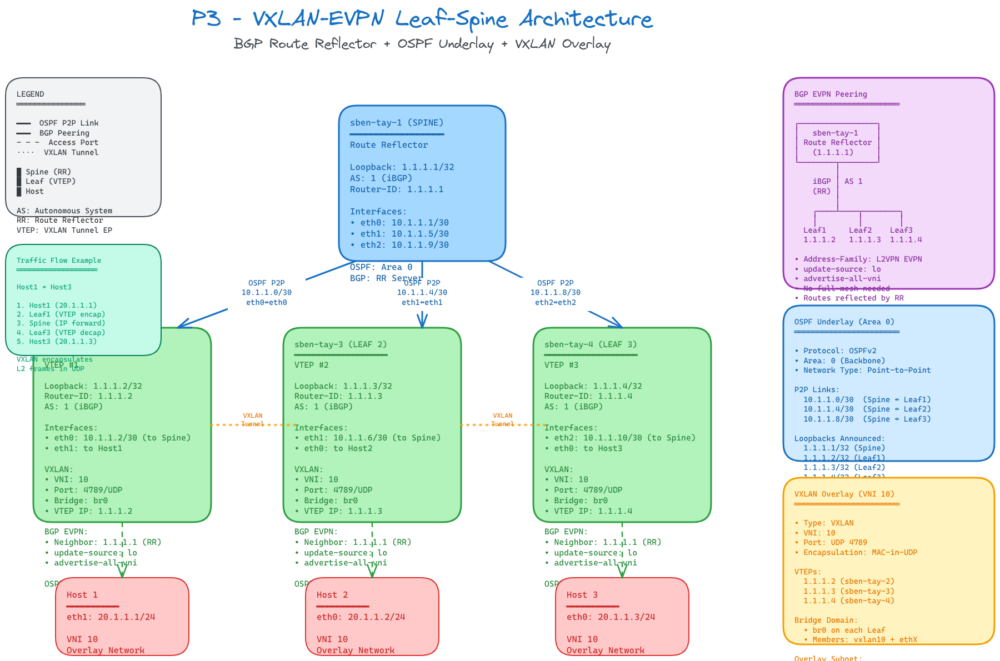

# VXLAN avec EVPN & Architecture Leaf-Spine

### Architecture Leaf-Spine qu'est-ce que c'est ?

L'architecture **Leaf-Spine** est un modèle de conception de réseau de datacenter à deux niveaux qui offre une haute performance, une faible latence et une grande évolutivité. Elle remplace l'architecture traditionnelle à trois niveaux (Core-Distribution-Access).



**Composants :**
- **Spine** : Les switches Spine forment la couche supérieure. Chaque Spine est connecté à tous les switches Leaf. Ils agissent comme des points de transit et ne se connectent pas directement aux serveurs.
- **Leaf** : Les switches Leaf forment la couche inférieure et se connectent directement aux serveurs, hôtes et autres équipements. Chaque Leaf est connecté à tous les Spines.

**Avantages :**
- **Latence prévisible** : Tout trafic entre deux hôtes traverse exactement le même nombre de sauts (2 sauts maximum).
- **Évolutivité horizontale** : Ajoutez simplement des Spines pour augmenter la bande passante ou des Leafs pour ajouter des ports.
- **Redondance native** : Multiples chemins disponibles entre chaque paire Leaf-Spine.

### OSPF (Open Shortest Path First) qu'est-ce que c'est ?

**OSPF** est un protocole de routage à état de lien (Link-State) utilisé pour distribuer les informations de routage au sein d'un système autonome (AS). C'est un protocole IGP (Interior Gateway Protocol) standardisé par l'IETF.

**Caractéristiques principales :**
- **Algorithme de Dijkstra** : Calcule le plus court chemin vers chaque destination.
- **Zones (Areas)** : Permet de segmenter le réseau pour améliorer l'évolutivité. L'**Area 0** (backbone) est obligatoire.
- **Convergence rapide** : Détecte rapidement les changements de topologie et recalcule les routes.
- **Sans boucle** : L'algorithme SPF garantit des chemins sans boucle.

Dans notre architecture, OSPF est utilisé pour :
- Annoncer les adresses **Loopback** de chaque équipement
- Permettre la connectivité IP entre tous les VTEPs pour l'établissement des tunnels VXLAN

### Loopback Interface (Lo) qu'est-ce que c'est ?

Une **interface Loopback** est une interface virtuelle qui n'est pas associée à un port physique. Elle est toujours active tant que l'équipement fonctionne.

**Utilisations :**
- **Identifiant stable** : Utilisée comme Router-ID pour BGP et OSPF
- **Source VTEP** : Adresse source pour les tunnels VXLAN
- **Haute disponibilité** : Ne dépend pas de l'état d'une interface physique

Dans notre topologie :
| Équipement | Loopback IP |
|------------|-------------|
| sben-tay-1 (Spine/RR) | 1.1.1.1/32 |
| sben-tay-2 (Leaf) | 1.1.1.2/32 |
| sben-tay-3 (Leaf) | 1.1.1.3/32 |
| sben-tay-4 (Leaf) | 1.1.1.4/32 |

### BGP EVPN qu'est-ce que c'est ?

**BGP EVPN** (Ethernet VPN) est une extension de BGP qui permet de distribuer les informations MAC et IP à travers le réseau de manière dynamique. C'est le plan de contrôle moderne pour VXLAN.

**Avantages par rapport au multicast :**
- **Pas besoin de multicast** : Utilise BGP pour la découverte des VTEPs et la distribution des MAC
- **Apprentissage MAC distribué** : Les adresses MAC sont annoncées via BGP plutôt qu'apprises par flooding
- **Support multi-tenancy** : Meilleure isolation entre clients
- **Route Reflector** : Simplifie le mesh BGP avec un point central (notre Spine)

### Route Reflector (RR) qu'est-ce que c'est ?

Un **Route Reflector** est un routeur BGP qui reflète les routes apprises d'un client iBGP vers d'autres clients iBGP, évitant ainsi le besoin d'un maillage complet (full-mesh) entre tous les peers BGP.

Dans notre topologie, **sben-tay-1** (Spine) agit comme Route Reflector pour tous les Leafs.

---

## Topologie de notre réseau VXLAN-EVPN




**VNI 10** connecte tous les hosts dans le même domaine L2 virtuel (20.1.1.0/24)

---

## Configuration des équipements

### sben-tay-1 (Spine / Route Reflector)

```bash
vtysh
conf t
hostname sben-tay-1
no ipv6 forwarding
!
interface eth0
 ip address 10.1.1.1/30
!
interface eth1
 ip address 10.1.1.5/30
!
interface eth2
 ip address 10.1.1.9/30
!
interface lo
 ip address 1.1.1.1/32
!
router bgp 1
 neighbor ibgp peer-group
 neighbor ibgp remote-as 1
 neighbor ibgp update-source lo
 bgp listen range 1.1.1.0/29 peer-group ibgp
 !
 address-family l2vpn evpn
  neighbor ibgp activate
  neighbor ibgp route-reflector-client
 exit-address-family
!
router ospf
 network 0.0.0.0/0 area 0
!
line vty
!
```

**Explications :**
- `bgp listen range 1.1.1.0/29 peer-group ibgp` : Accepte dynamiquement les connexions BGP depuis les Leafs
- `neighbor ibgp route-reflector-client` : Configure les Leafs comme clients du Route Reflector
- `address-family l2vpn evpn` : Active l'échange de routes EVPN
- `router ospf network 0.0.0.0/0 area 0` : Annonce toutes les interfaces dans OSPF Area 0

---

### sben-tay-2 (Leaf 1)

```bash
# Configuration des interfaces VXLAN et Bridge
ip link add br0 type bridge
ip link set dev br0 up
ip link add vxlan10 type vxlan id 10 dstport 4789
ip link set dev vxlan10 up
brctl addif br0 vxlan10
brctl addif br0 eth1

# Configuration FRR
vtysh
conf t
hostname sben-tay-2
no ipv6 forwarding
!
interface eth0
 ip address 10.1.1.2/30
 ip ospf area 0
!
interface lo
 ip address 1.1.1.2/32
 ip ospf area 0
!
router bgp 1
 neighbor 1.1.1.1 remote-as 1
 neighbor 1.1.1.1 update-source lo
 !
 address-family l2vpn evpn
  neighbor 1.1.1.1 activate
  advertise-all-vni
 exit-address-family
!
router ospf
!
```

**Explications :**
- `ip link add vxlan10 type vxlan id 10 dstport 4789` : Crée l'interface VXLAN avec VNI 10
- `brctl addif br0 vxlan10` : Ajoute l'interface VXLAN au bridge
- `neighbor 1.1.1.1 update-source lo` : Utilise la loopback comme source BGP
- `advertise-all-vni` : Annonce automatiquement tous les VNI locaux via EVPN

---

### sben-tay-3 (Leaf 2)

```bash
# Configuration des interfaces VXLAN et Bridge
ip link add br0 type bridge
ip link set dev br0 up
ip link add vxlan10 type vxlan id 10 dstport 4789
ip link set dev vxlan10 up
brctl addif br0 vxlan10
brctl addif br0 eth0

# Configuration FRR
vtysh
conf t
hostname sben-tay-3
no ipv6 forwarding
!
interface eth1
 ip address 10.1.1.6/30
 ip ospf area 0
!
interface lo
 ip address 1.1.1.3/32
 ip ospf area 0
!
router bgp 1
 neighbor 1.1.1.1 remote-as 1
 neighbor 1.1.1.1 update-source lo
 !
 address-family l2vpn evpn
  neighbor 1.1.1.1 activate
  advertise-all-vni
 exit-address-family
!
router ospf
```

---

### sben-tay-4 (Leaf 3)

```bash
# Configuration des interfaces VXLAN et Bridge
ip link add br0 type bridge
ip link set dev br0 up
ip link add vxlan10 type vxlan id 10 dstport 4789
ip link set dev vxlan10 up
brctl addif br0 vxlan10
brctl addif br0 eth0

# Configuration FRR
vtysh
conf t
hostname sben-tay-4
no ipv6 forwarding
!
interface eth2
 ip address 10.1.1.10/30
 ip ospf area 0
!
interface lo
 ip address 1.1.1.4/32
 ip ospf area 0
!
router bgp 1
 neighbor 1.1.1.1 remote-as 1
 neighbor 1.1.1.1 update-source lo
 !
 address-family l2vpn evpn
  neighbor 1.1.1.1 activate
  advertise-all-vni
 exit-address-family
!
router ospf
```

---

### Configuration des Hosts

#### Host 1
```bash
ip addr add 20.1.1.1/24 dev eth1
```

#### Host 2
```bash
ip addr add 20.1.1.2/24 dev eth0
```

#### Host 3
```bash
ip addr add 20.1.1.3/24 dev eth0
```

---

## CLI TESTING

Commandes pour vérifier l'état de la configuration.

### Vérification OSPF
```bash
# Affiche les voisins OSPF
vtysh -c "show ip ospf neighbor"

# Affiche la base de données OSPF
vtysh -c "show ip ospf database"

# Affiche les routes OSPF
vtysh -c "show ip route ospf"
```

### Vérification BGP EVPN
```bash
# Affiche les voisins BGP
vtysh -c "show bgp summary"

# Affiche les routes EVPN (Type-2 = MAC/IP, Type-3 = IMET)
vtysh -c "show bgp l2vpn evpn"

# Affiche les VNI locaux
vtysh -c "show evpn vni"

# Affiche les MAC apprises via EVPN
vtysh -c "show evpn mac vni all"
```

### Vérification VXLAN/Bridge
```bash
# Affiche toutes les interfaces et leur état
ip link show

# Détails de l'interface VXLAN
ip -d link show vxlan10

# Affiche les ports du bridge
bridge link

# Affiche la table FDB (MAC addresses)
bridge fdb show

# Affiche la table FDB du bridge br0
bridge fdb show br br0
```

### Test de connectivité
```bash
# Depuis Host1, ping vers Host2 et Host3
ping -c 3 20.1.1.2
ping -c 3 20.1.1.3

# Observer les paquets VXLAN sur le Leaf
tcpdump -n -i eth0 udp port 4789
```

---

## CLI DEBUGGING

Commandes utiles pour diagnostiquer les problèmes.

```bash
# Voir les derniers messages du noyau
dmesg | tail -n 50

# Vérifier si le forwarding IP est activé
sysctl net.ipv4.ip_forward

# Vérifier l'état des voisins ARP
ip neigh show

# Debug BGP
vtysh -c "debug bgp updates"
vtysh -c "debug bgp evpn mh"

# Vérifier les logs FRR
cat /var/log/frr/frr.log

# Tracer les routes vers une destination
traceroute 1.1.1.2
```

---

## CLI CLEAR

Commandes pour nettoyer la configuration.

```bash
# Supprime l'interface VXLAN
ip link del vxlan10

# Désactive et supprime le bridge
ip link set br0 down
ip link del br0

# Supprime les adresses IP des interfaces
ip addr flush dev eth0
ip addr flush dev eth1

# Vider la table FDB
bridge fdb flush dev vxlan10

# Réinitialiser les sessions BGP
vtysh -c "clear bgp *"
```
